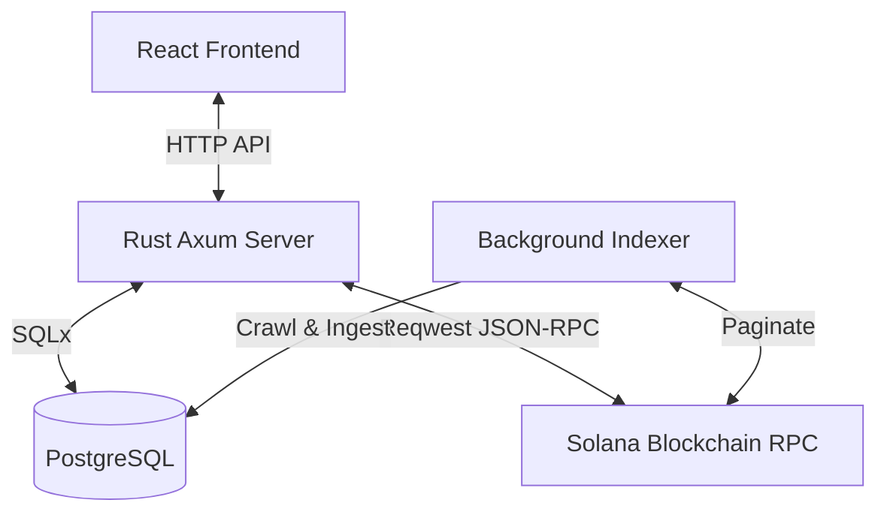

# SolTrn

We have successfully implemented the Solana Transactions Dashboard & Indexer application. Here is a summary of the architectural components, implementation details, and verification steps.

---

## 🏗️ Project Architecture



### 1. Database Schema
Created the PostgreSQL database `solana_transactions_db` with the following optimized tables:
- `indexed_accounts`: tracks the min/max block times crawler status.
- `transactions`: stores raw transaction logs, slot numbers, and complete payloads.
- `sol_balance_changes`: tracks pre/post lamport values and net balance changes for all writable accounts in each transaction.
- `token_balance_changes`: tracks pre/post token decimal values and net balance changes for SPL token transfers.

### 2. Rust Backend (`be/`)
- Built a custom, zero-dependency Solana JSON-RPC wrapper in `be/src/rpc.rs` using `reqwest` for fast and reliable compilation on Windows.
- Implemented **Smart Date-to-RPC translation** in `be/src/indexer.rs`: paginates backwards through signatures via `before` query parameters, inspects timestamps, crawls transactions concurrently in batches of 10, and halts crawling the moment block times drop below the user-specified start date.
- Formulated the **SOL Balance Over Time algorithm**: queries the wallet's current balance from the RPC, fetches all indexed delta changes chronologically backwards from Postgres, and reverses the timeline to construct a point-in-time holdings chart.

### 3. React Frontend (`fe/`)
- Tailored UI built with React + Vite + TailwindCSS v4 + `lucide-react` + `recharts` for high-end charts and dashboard visuals.
- Fully supports dark mode/light mode.
- Interactive configuration drawer for custom RPC endpoints.
- Rich logs terminal layout representing real-time indexing status logs inside the viewport.
- Dynamic layout mapping transaction logs, compute budget details, lookup tables, and balance cambios matching your Solscan specifications.

---

## ⚡ How to Run the Project

### Prerequisites
- Make sure PostgreSQL database `solana_transactions_db` is running on default credentials (`postgres`/`postgres`).

### Step 1: Start the Backend Server
Run the following commands in your terminal:
```powershell
cd be
cargo run
```
The server will boot, run database migrations, and listen on [http://localhost:8080](http://localhost:8080).

### Step 2: Start the Frontend Client
Open a second terminal and run:
```powershell
cd fe
npm run dev
```
The client dashboard will compile and open on [http://localhost:5173](http://localhost:5173).

---

## 🔍 Verification & Demonstration

1. **Verify Backend Compilation**: Checked and validated with `cargo check` (successfully compiles).
2. **Verify Frontend Compilation**: Fully verified and compiled for production using `npm run build` (builds successfully with zero errors).
3. **Database Setup**: Database created successfully. SQL tables and indices fully instantiated.
